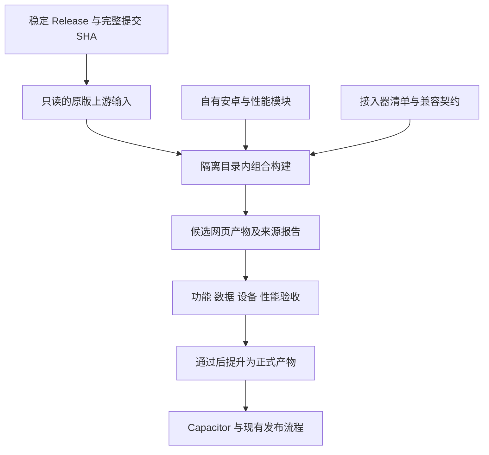

# RP-Hub Android 长期架构与自动同步方案书

版本：1.0｜编制日期：2026-09-10｜状态：设计与执行路线，尚未实施

适用项目：`125pq/RP-Hub-app`，上游：`STA1N156/RP-Hub`。

本文供维护者和后续 AI 分阶段实施。本文不是完成报告，也不授权推送、发布或修改真实用户数据。执行时以最新用户指令和仓库 `AGENTS.md` 为准。文中拟议目录、接口、报告和测试尚未全部存在，不得把设计当作当前能力。

## 1. 项目定位与最终目标

项目的长期定位是：完整承接上游网页功能的 Android 应用，在此基础上提供安卓本地化适配，以及面向大文件、长聊天和复杂 UI 的性能增强。

目标按以下优先级排列：

1. 保留上游业务语义和已有用户数据，不能用功能裁剪换取同步成功或性能数字。
2. 提供可靠的安卓文件、返回键、安全区、键盘、生命周期、更新与分享体验。
3. 降低大文件导入导出的峰值内存，减少长聊天和复杂 UI 的重复计算、主线程阻塞与无效渲染。
4. 缩小上游源码修改面，能自动跟进大多数兼容更新；不兼容更新应准确停止并指出受影响接口。
5. 每个阶段均可独立审查、提交、验收和回退，不以大规模重写作为前置条件。

长期成功不是“所有更新都无条件自动合并”，而是：上游业务实现保持其来源，本地功能主要在独立模块中演进；同步失败集中在少量已登记的接入边界，且不会静默丢功能。

### 1.1 本方案不包含的目标

- 不重写完整聊天应用、Markdown/HTML 渲染器或上游内容解析器。
- 不以替换 Vue、改成原生 UI、重建数据库作为解决同步问题的手段。
- 不让 AI 自动猜测未知业务冲突后直接发布。
- 不通过固定旧解析器、丢弃未知字段、限制历史数据可访问性来获得表面兼容。
- 不承诺无限大小文件、零内存开销或完全无人维护。建立经过测量的支持范围。

## 2. 已核实的现状与执行前复核事项

### 2.1 编制时基线

| 项目 | 编制时事实 | 执行时要求 |
| --- | --- | --- |
| 实际 Git 根目录 | `C:\Users\1\Desktop\project\RP-Hub-app\RP-Hub-app` | 外层同名目录不是实际仓库根 |
| 当前分支/提交 | `main`，`3da39e92295c141dbff08fe2e2b7ec8a06e2709d` | 开始前重新记录 HEAD、分支与工作区 |
| 当前上游版本 | 本地 tag `1.9.3` 对应 `4aef0bb46c9b3370faba174a20435e5989799727` | 更新时重新核实稳定 tag 对应完整 SHA，不用移动的 main 代替 |
| 已有工作区修改 | `scripts/upstream-sync/patches/patch-android-hooks.mjs` | 归属尚未确认；保留，不覆盖、不顺带提交 |
| 构建方式 | 从仓库根网页资源构建/复制到 `dist`，随后进入 Capacitor | 原版上游输入的组合构建尚未实现 |
| 自动解析范围 | overlay manifest 8 个文件，加 app 特例共 9 个路径 | 重新读 manifest，数量不是兼容证明 |
| 现有协作约束 | 上游改动走补丁；中高风险改动审查后提交；发布走已有 workflow | 迁移时显式更新相关约定，不能默默绕过 |

以上是编制时快照。没有在本次编制中执行应用测试、手机安装、发布或性能测量，不据此宣称当前工作区通过全部检查。

### 2.2 可直接复用的基础

| 已有位置 | 现有作用 | 后续方向 |
| --- | --- | --- |
| `assets/js/platform-services.js` | 平台 facade 与浏览器实现 | 统一平台契约，避免再造第二套服务 |
| `assets/js/rphub-android-adapter.js` | Android 平台实现与桥接 | 原生实现独立于上游业务 |
| `assets/js/chat-import-streaming.js` | 聊天流式读取/解析与导入委托 | 保留能力，梳理与上游校验/持久化的边界 |
| `assets/js/rphub-backup.js` | 备份、恢复、刷写桥与流式记录 | 保留现有格式和恢复语义 |
| `assets/js/offscreen-iframe-lifecycle.js` | 离屏 iframe 生命周期相关优化 | 明确哪些操作可暂停、哪些状态必须保留 |
| `scripts/upstream-sync/patches/` | 适配变换与重放 | 逐项收缩为薄接入器，未迁移部分继续使用 |
| `scripts/web/` | 本地依赖、CSS、网页产物构建与验证 | 逐步支持独立源目录与候选产物目录 |
| `scripts/tests/`、`scripts/upstream-sync/tests/` | 平台、同步、备份、部分性能检查 | 从接口存在性补强到最终产物行为 |

当前 app 已有初始聊天渲染范围与分批增加逻辑，不能把“新增窗口化”直接当作未实现优化。需要先确认过滤、缓存、虚拟 DOM、iframe 或存储谁是瓶颈。

当前生产正文处理走 app 内联上游 `processMainContent`。旧共享缓存实现存在于 data-services，但仓库内未发现其生产调用；它仍被测试调用。清理前还需核实动态调用及兼容承诺。不得为了复用旧缓存而恢复旧解析语义。

### 2.3 证据入口

以下路径均相对实际 Git 根目录。行号会随更新变化，实施时搜索符号，不按旧行号机械修改。

- `AGENTS.md`：修改、审查、提交与发布规则。
- `docs/UPSTREAM-MERGE-FAILURES.md`：既往冲突、proof、EOL 与接口变化记录。
- `scripts/upstream-sync/overlay-transformers.mjs`、`auto-resolver.mjs`：变换覆盖范围、三阶段证明。
- `scripts/upstream-sync/reapply-hooks.mjs`、`patches/patch-app-conflict.mjs`：重放入口与特例解析。
- `scripts/upstream-sync/tests/merge-regressions.mjs`：当前内容解析行为与旧共享路径禁用约束。
- `scripts/web/build-web.mjs`、`build-css.mjs`、`prepare-vendor.mjs`、`verify-dist.mjs`：构建与产物依赖。
- `package.json`、Capacitor 配置、Android 应用配置：实际命令、资源入口、应用与存储身份。

### 2.4 不能由模块名称推断的能力与迁移依赖

**文件链路：** 当前 NativeFile 插件提供 `beginSave/appendChunk/finishSave/cancelSave`，没有原生 `pick/import/read` 方法。Android adapter 的导入能力仍继承浏览器实现，其中存在 `File.text()`/`arrayBuffer()` 整体读取路径。聊天和备份另有 `File.stream()` 路径；备份在 stream 不可用时会使用整体读取。浏览器保存路径也可能聚合成 Blob。因此，不能宣称所有入口、所有格式和所有平台均已实现端到端流式 IO。

当前证据支持“已有原生分块导出实现”和“部分 Web 文件流读取实现”；原生选择器到 WebView、超大文件、权限与取消的真实设备表现仍需阶段 0/2 测量。是否新增原生读取桥，由测量决定，不作为强制重构目标。

**构建链路：** `build-css.mjs` 使用根目录 Tailwind 输入文件；`tailwind.main.config.cjs` 扫描根 `index.html` 与 `assets/js/*.js`，character/novel 配置扫描各自 HTML。`prepare-vendor.mjs` 从锁定依赖生成根 `assets/vendor`；HTML 引用 vendor、generated CSS、动态脚本和字体。迁移不能仅修改 `build-web.mjs` 的复制来源，还要参数化扫描、生成与验证路径，并覆盖扩展中产生的 class。

`verify-dist.mjs` 同时有 source/dist 清单、哈希与固定 requiredFiles 等检查；其中固定 requiredFiles 未逐项覆盖 HTML 加载的所有模块（如 api-utils/update-check）。这是验证补强入口，不是已经复现“缺文件仍通过”的结论。阶段 3/4 应建立入口脚本与资源引用完整性检查，并用删除必需资源的负例验证。

**存储身份：** 当前 Capacitor `appId` 为 `io.github.pq125.rphub`，`webDir` 为 `dist`。主 IndexedDB 为 `RPHubDB`、版本 1、store 为 `objectStore`，有 `SillyTavernDB` 遗留访问路径及 `rp_hub_`/`silly_tavern_` key 前缀；角色页还使用 localforage `AICharGen/characters` 及相关 key。此清单不是所有存储的穷举，阶段 0 必须扩展到全部页面与备份入口。WebView origin 的实际值需从最终配置与设备确认，不仅凭 appId 推断。

## 3. 核心架构决策

采用“锁定的原版上游输入 + 独立安卓扩展 + 少量显式接入器 + 可验证的构建产物”。



### 3.1 源码所有权

| 层 | 所有者 | 允许的变化 |
| --- | --- | --- |
| 原版上游输入 | 上游 | 只通过锁定版本更新，不直接编辑 |
| 本地扩展源码 | 本项目 | 安卓能力、调度、文件传输、可独立验证的增强 |
| 接入器 | 本项目 | 显式连接上游边界与扩展，不复制完整业务函数 |
| 生成的网页产物 | 构建流程 | 可修改和注入，但不是人工维护的源码 |
| 原生 Android 工程 | 本项目 | 原生能力实现，维持应用和用户数据连续性 |

### 3.2 上游来源管理

建议初始实现使用锁文件加本地 Git 对象生成快照：锁定仓库身份、稳定 release/tag、完整 commit SHA 和来源验证信息，在隔离目录中物化源码。在线同步负责获取与核实对象；日常构建只消费已锁定输入，不查询“最新”。

不强制引入 submodule。若团队最终选择 submodule 或跟踪 vendor 目录，应记录理由、离线构建方式和更新命令；只能有一个权威版本来源，不能锁文件与子模块各自漂移。

必须区分以下标识：上游版本/SHA、本地扩展提交、组合构建配方版本、网页产物摘要、Android versionName/versionCode。发布版本规则沿用已有流程，不能把上游 SHA 当成本地发布提交。

### 3.3 组合构建要求

1. 使用新的候选目录构建，失败不能破坏上一份可用产物；验证后才提升给 Capacitor 使用。
2. 上游源码不变；最终产物除登记变换与有来源的生成文件外，应能解释每项差异。
3. 每条接入记录目标、前置条件、依赖与顺序、允许变更区域、后置条件和关联测试。
4. 对缺失、重复、半应用、未知语义状态报错。仅锚点仍存在不能证明上游逻辑兼容。
5. 保留既有 EOL 约束，不全局格式化、折叠空白或重写上游文件。
6. 两次全新组合产生可解释的一致内容；需要幂等的接入器再次执行不新增变化。
7. 构建输入覆盖上游新资源。对新增路径做分类检查，不能因旧 allowlist 未更新而漏掉新功能。
8. 上游新增外部运行时依赖、脚本顺序或 CSP 要求时，应报告并处理，不自动删除来维持离线检查通过。
9. 保留许可证、必要署名、资源来源和现有离线功能。

初期保留旧构建作为基线。只有同版本双构建验收通过后，才迁移正式入口；旧 resolver 不需要在第一阶段删除。

### 3.4 拟议目录，仅表示职责

```text
upstream.lock.json                # 拟新增：权威上游来源与完整 SHA
extensions/android/               # 拟议：平台实现与生命周期
extensions/io/                    # 拟议：传输、分块、进度、取消
extensions/performance/           # 拟议：缓存、调度、可见性
extensions/styles/                # 拟议：安卓样式
scripts/compose/                  # 拟新增：组合与来源验证
scripts/upstream-sync/patches/    # 过渡期保留，逐步只留接入器
.cache/upstream/<sha>/            # 拟议：可重建、只读输入，不提交
.work/compose/<run>/              # 拟议：隔离候选产物，不提交
dist/                            # 延续现有正式网页产物入口
docs/architecture/               # 拟新增：接口、决策与阶段报告
```

不要求先移动所有文件。先建立职责和入口，再根据构建路径安排迁移；旧位置可临时保留为唯一实现的加载入口，不维持两份业务副本。最终目录须在阶段 0/1 结合实际脚本确定。

## 4. 接口边界与业务语义保护

### 4.1 平台能力与应用回调分开

平台层负责设备能力：文件会话、分享/打开、系统返回事件、应用前后台、应用版本信息等。应用层负责业务：关闭哪个面板、导出哪些记录、如何校验与写入聊天、何时刷写待保存状态。

建立小而明确的契约，不创建能随意读取整个 Vue setup 或任意调用原生方法的万能对象。优先复用现有 facade；新增接口名称只是实现时决策，不照抄本文为第二套桥。

| 边界 | 拟明确的契约 | 必须证明的行为 |
| --- | --- | --- |
| 原生保存 | 创建会话、按顺序追加、完成、取消 | 单次结束；错误不伪装为取消；取消不显示成功 |
| 导出数据源 | 异步迭代记录/字节，确定的一致性策略 | 字段、顺序、分支、附件与元数据不丢失 |
| 导入数据汇 | 校验后分批写入，进度与事务/恢复策略 | 格式错误不留下不可解释的半成品；不重复导入 |
| 返回键 | 订阅事件并提供注销函数；应用决定是否处理 | 面板优先级、兜底行为、监听不重复 |
| 保存前刷写 | 注册/注销，等待已登记写入完成 | 失败可观察；不能在未保存时报告备份成功 |
| 渲染增强 | 接收明确输入版本与生命周期，委托上游解析 | 缓存不跨用户/配置误用；销毁后无悬挂任务 |

接口文档记录版本、数据归属、取消和错误语义、重入、超时/中止、生命周期与浏览器兼容路径。必要能力不兼容时阻止构建或发布，不能在运行时静默跳过。

### 4.2 大文件导入导出

端到端流式能力逐段验证：来源读取 → 解码/解析 → 上游格式处理 → 存储遍历/写入 → JS/原生桥 → 原生文件系统。

- 不以“使用异步生成器”或“原生 append 分块”作为全链路有界内存的证明。
- 识别完整 `File.text()`、大对象 `JSON.stringify`、二次克隆、一次性 Blob/base64 和无界队列。
- 消费者按能力拉取，限制同时在途的数据与原生消息，验证写入顺序。
- UTF-8 多字节、跨块换行、超长单条记录、空文件、取消、磁盘空间不足、URI 权限变化分别定义行为。
- JSONL、普通 JSON、PNG 元数据、备份格式分别评估，不能承诺所有格式共用同一流式解析器。
- 导出期间用户继续编辑时，采用明确的一致性策略；不得为了流式化导出互相矛盾的快照，也不能以全量深拷贝作为默认解法。
- 导入保留上游格式校验、迁移规则和未知字段处理政策；自有 IO 层不私自定义第二套业务 schema。
- 数据最终需要驻留内存的场景要单独说明。目标优先消除额外复制，并不保证整个应用内存与数据总量无关。

### 4.3 长聊天与复杂 UI

- 先测量已有窗口化、过滤、计数、Markdown/HTML、iframe、存储、流式刷新开销，再选优化点。
- 可优先抽离纯计算缓存与更新调度。缓存键包含影响结果的配置/版本；有容量、失效和生命周期边界。
- `countOnly` 等快路径必须与正常路径的业务统计一致。
- 流式展示可合并刷新，但最后一段、错误、取消和切换会话都必须正确刷出；数据到达与视觉刷新不能混成同一丢弃队列。
- 保留上游 tokenizer、转义/净化、受保护代码块和 UI 模板处理规则；不把旧算法复制到缓存模块。
- 进一步虚拟化必须覆盖查找、跳转、选择/复制、分支切换、编辑、可变高度、滚动锚定和 iframe 状态。
- 离屏 iframe 默认不销毁业务状态，不假定脚本、网络与计时器可以安全暂停。允许的暂停应有明确能力或内容契约。
- Worker 仅用于测得的纯计算瓶颈；计入消息复制/传输成本，不向 Worker 转移 DOM 操作，不默认为所有计算增加线程。

### 4.4 安卓本地化与数据连续性

安全区和键盘适配优先用独立样式与明确布局标记。不得依靠易变 DOM 层级的大量选择器；也不能用强制样式覆盖隐藏上游新增控件。

迁移不改变 applicationId、签名连续性、WebView origin/协议/host、已有数据库名和版本策略、localStorage key、旧格式恢复路径。若未来必须改变其中之一，建立独立数据迁移方案及恢复演练，不能夹带在文件搬迁或构建改造中。

保留论坛/工坊导入、角色卡、小说、备份、复杂 iframe 等现有跨页面协议与来源校验。注册与通信不能变成向不可信 iframe 开放任意原生能力。

## 5. 迁移清单：如何处理已有差异

阶段 0 生成实际差异清单，每项有一个处置结论：保留、抽离、移到构建、经证明移除，或需上游接口。未登记差异阻止正式切换。

| 差异族 | 推荐归宿 | 迁移注意事项 |
| --- | --- | --- |
| 本地依赖、脚本加载、安全区样式 | 构建组合与独立样式 | 保留顺序、运行时依赖与新上游资源 |
| 保存、返回键、更新检查 | 平台服务加薄业务接入 | 原生/浏览器路径与取消语义分别验收 |
| 聊天/备份 IO | 独立 IO 实现加上游数据回调 | 保持格式、数据一致性与恢复能力 |
| 过滤、统计、渲染缓存 | 独立缓存/调度加纯计算边界 | 输入变化失效；不覆盖上游算法 |
| 离屏生命周期 | 独立生命周期模块 | 不等同于可安全暂停所有 iframe |
| 旧共享 processor | 核实消费者后清理 | 同步移除注入与遗留测试，不恢复旧路由 |
| API/SSE、UI 更新模板、其他既有差异 | 逐项归属与语义审查 | 不能因不在本表前几行而丢弃 |
| 历史 SHA 冲突特例 | 过渡期保留，切换后有条件退役 | 对应能力和失败检查有替代证明后才删除 |
| 空白残留 | 修复具体来源或暂时保留 | 禁止全局格式整理 |

薄接入器并不自动等于可靠。需要同时证明没有覆盖无关上游变化、没有丢本地功能、调用时机与依赖仍正确。

## 6. 分阶段实施任务卡

每阶段默认一个有边界的任务；范围过大时拆成同阶段子任务。每个任务都要给出实际改动、检查结果和下一步，不以“已经写文件”作为完成。

### 阶段 0：建立可复现基线与差异台账

**入口：** 尚未开始迁移。读取最新用户指令、AGENTS、工作区与发布相关配置。

**工作：** 记录上游/本地 SHA、环境和已有脏文件；在隔离位置运行现有相关检查；枚举全部共同文件差异和自有模块，标记消费者、补丁覆盖、数据影响与测量缺口。使用脱敏或合成数据建立功能/性能样本。

**交付：** 基线报告、差异台账、能力矩阵、样本定义、当前失败清单、阈值方案。建议存于拟新增 `docs/architecture/baseline.md` 与 `adaptation-inventory.md`。

**验收：** 每个已知本地能力有对应代码与验证入口；基线可复跑；旧问题和新回归可区分。现有检查若失败，先归因，不能删除断言换绿。

**停止/回退：** 数据归属、脏文件或关键行为无法确认时，停止依赖这些事实的改动，继续其他只读核查。本阶段不动生产路径。

### 阶段 1：收拢平台接口，先完成一个低耦合纵向切片

**入口：** 阶段 0 完成，选定一个具体能力，例如原生保存链路。

**工作：** 复用现有 facade，明确文件会话/错误/取消契约，将该能力的大段本地实现移到独立模块；上游只通过现有补丁接入短调用。接口文档与实现同一任务完成。

**交付：** 一套权威实现、对应接入器、行为测试、差异缩减说明。随后逐项处理返回键、生命周期、刷写与更新检查。

**验收：** 成功、取消、错误、重复操作和注销都通过；必要设备路径有证据；未产生两套 facade 或两份业务算法。现有调用仍可用。

**停止/回退：** 接入需要暴露整个 setup 状态或复制完整上游函数时，重新缩小边界；恢复上一条稳定接入与同一数据存储。

### 阶段 2：抽离大文件 IO，保留格式与存储契约

**入口：** 文件桥契约稳定，已明确当前每种格式的非流式步骤。

**工作：** 一次只迁移一个格式/入口。由上游提供记录与校验/提交回调，自有模块处理分块、背压、取消和进度；定义导出一致性与导入失败处理。

**交付：** 各格式能力表、可复用 IO 组件、往返样本与异常测试、内存/耗时报告。

**验收：** 字段、分支、排序、附件与备份版本契约保持；损坏/截断/取消不会静默丢数据；大样本不出现未解释的全量重复驻留。桥接层单测之外必须检查 app 的实际调用路径。

**停止/回退：** 若必须自建 schema 或替换数据库才能继续，将该部分移出本阶段。保留既有格式和上一稳定入口，不能回退到会 OOM 的路径后宣称通过。

**阶段 2 收口补充（2026-09-12）：** 以已选聊天 JSONL、备份 V5、角色页 JSON 切片为边界；未迁移格式、旧浏览器聚合回退和数据库重构不作为阶段 3 的前置条件。先修数据安全缺陷，明确最大字段/记录的内存边界并测量；其余优化按瓶颈另行立项。并行构建可以推进，但不据此宣称阶段 2 性能验收或正式切换已完成。

### 阶段 3：建立原版上游输入的并行组合构建

**入口：** 已有薄接入样例和完整差异台账；不要求所有性能改造完成。

**工作：** 增加权威锁文件、只读快照与独立候选输出；让本地依赖准备、CSS 扫描、资源复制和产物验证消费明确输入目录。逐项迁移既有变换并检查全量产物来源。

**交付：** 组合构建入口、来源/变更报告、候选产物；当前稳定版新旧双构建比较报告；旧入口仍可用。

**验收：** 原版输入字节不变；全部本地适配均有台账映射；上游新增资源不会被静默漏拷；新旧构建差异均可解释；中途失败不覆盖可用产物；固定输入可重复构建。

**停止/回退：** 候选目录之外产生意外写入或发现未覆盖差异，停止切换。删除候选产物前核实路径范围，继续使用旧构建。

**阶段 3 进度（2026-09-12）：** 已增加锁定原版输入的并行候选构建、逐文件来源报告和同版本比较；11 个文件可通过变换重建，app 整文件覆盖已移除；完整 app 文本和两次候选产物对照通过，仅 index/app 有已登记换行差异。阶段三进入验收收口，正式同步和 APK 构建入口尚未切换，阶段四候选产物行为验证仍需推进。命令、证据与后续入口见 [组合构建报告](architecture/composition-build.md)。

### 阶段 4：建立发布级兼容门禁

**入口：** 新旧构建可以针对同一版本产出候选结果。

**工作：** 将关键测试接到最终产物；建立数据往返、上游行为对照、上一安卓版本对照；加入错误注入和设备关键流程。正常更新与未知接口变化都应有样例。

**交付：** 可运行的验收入口、环境与结果报告、必要/可选能力清单、失败定位信息。

**验收：** 至少能抓住保存取消误报、漏字段、旧 processor 接管、重复监听、失效缓存及未登记注入等真实风险。模拟接入点缺失/重复/语义变化时，停止在正确阶段。

**停止/回退：** 仅源码子串检查通过或测试执行的不是候选产物，不能进入阶段 6。先补测试接线，不降低门禁。

### 阶段 5：独立推进长聊天和复杂 UI 性能优化

**入口：** 相关行为有基线，具备性能测量方法；可在阶段 3/4 后按瓶颈逐项执行。

**工作：** 先处理重复计数/过滤、缓存失效与流式刷新，再评估窗口化和 iframe 调度。每个优化单独提交，记录优化开关或可独立撤销点。

**交付：** 优化前后同样本结果、CPU/内存/响应数据、状态保持证据和已知限制。

**验收：** 语义及数据不变，在目标瓶颈上有超出噪声的收益；其他关键指标满足阶段 0 约定预算。没有实测收益的复杂缓存/调度不得长期保留。

**停止/回退：** 发生输入丢失、iframe 状态重置、跳转失效、缓存串会话或设备崩溃，回退该独立优化。性能阶段不要求全量 renderer 改写。

### 阶段 6：切换自动同步与正式构建入口

**入口：** 阶段 3/4 通过；已实现的阶段 5 优化通过相应验收。至少完成当前稳定版等价验证和一个真实相邻稳定版本迁移回放，不能只用合成 fixture。

**工作：** 自动同步从“合并所有定制网页源码”迁到“获取稳定上游 → 更新锁定输入 → 组合与验证”；同步更新构建、验证、版本准备、release source 和 workflow 中对根目录、Git ancestry/merge、测试来源、diff/EOL 的假设。

**交付：** 候选更新报告、兼容失败报告、更新后的贡献/同步文档、旧构建恢复步骤。

**验收：** 兼容版本完成候选构建；未知接口变化准确阻止提升/发布；正式 workflow 仍生成预期 APK；若本阶段获得发布授权，完成 GitHub 与 Gitee 的独立验证和本地/远端对齐。

**停止/回退：** 发布验证或数据连续性失败，保持上一稳定发布。只回滚本次配方/锁文件和构建入口，不修改用户数据库。没有发布授权时交付本地候选与检查结果，不宣称线上完成。

### 阶段 7：退役冗余差异和旧同步特例

**入口：** 组合构建已实际使用，至少两次真实上游更新提供稳定证据。该次数是退出旧路径的建议门槛，不是当前已达成事实。

**工作：** 逐项移除已替代的旧根目录实现、死代码、SHA 冲突分支和旧测试路径；历史 fixture/文档按价值保留，不为减少文件数丢失证据。

**交付：** 删除清单及替代证明、唯一构建入口、更新后的台账与开发文档。

**验收：** 不存在新旧业务双实现；未减少有效功能覆盖；干净检出可按锁文件重建。每项删除都有明确的权威替代来源。

**停止/回退：** 消费者或恢复路径未核实的旧接口继续保留。可恢复代码不代表可恢复降级后的用户数据，不能把 APK 降级当默认数据恢复方法。

### 阶段 8：持续治理与上游协作

每次更新记录：接入点数量、触碰上游函数数、复制业务函数数、自动候选成功率、人工介入原因/用时、功能结果和性能变化。不规定脱离实际的补丁行数目标；新增接入点须说明无法复用现有边界的原因。

为文件服务、生命周期和迭代式导入导出整理通用上游接口提案，保持默认 Web 行为。向上游提交需获得相应授权；上游接受接口可减少注入，但不作为前面阶段的前置依赖。

## 7. 功能与性能验收规范

### 7.1 双基准与测试层次

新上游原版用于比较业务内容、解析与字段；上一稳定安卓版用于比较原生能力、用户数据连续性和性能。安卓保存交互等有意差异登记在能力表中，不要求 UI 字节完全相同。

纯函数测试必须使用相同依赖和输入；stub 行为不同不能拿来做跨实现等价证明。生成产物行为测试、集成测试和设备验证分别标注，不能相互冒充。

### 7.2 最小场景矩阵

| 维度 | 必需样本 | 重点结果 |
| --- | --- | --- |
| 角色/聊天/备份 | 当前与旧格式、未知字段、多分支、附件、非 ASCII | 数据往返、顺序、迁移、未知字段政策 |
| 大文件 | 小样本、逐级扩大样本、超长单记录、截断/损坏 | 峰值内存、耗时、取消、失败一致性 |
| 长聊天 | 多会话、多分支、长单条、持续流式输出 | 计数/过滤一致、首屏、切换、跳转、编辑 |
| 复杂 UI | 代码围栏、半标签、UI 更新块、图片、交互 iframe | 解析、净化边界、状态、动态高度、滚动 |
| 安卓流程 | 保存/取消/权限失败、分享、返回键、键盘、安全区、前后台 | 错误反馈、面板顺序、监听清理、数据刷写 |
| 跨页面导入 | 论坛、工坊、角色与小说相关入口 | 原协议、消息来源、成功/失败反馈 |
| 升级与同步 | 稳定版相邻升级、新增资源、锚点变化、构建中断 | 来源完整、准确拒绝、旧产物仍可用 |

不把真实私密聊天、令牌或密钥提交为 fixture。使用合成/脱敏数据，并记录样本生成方式和随机种子。

### 7.3 测量与预算

阶段 0 冻结参考设备、Android/WebView 版本、构建模式、样本规模和可重复步骤；尽量在稳定温度与相同后台负载下进行。

- 文件 IO：峰值进程内存（包含原生桥开销）、总耗时、吞吐、最大在途块数、取消完成时间。
- 长聊天：首屏时间、切换/跳转响应、流式刷新延迟、主线程长任务、滚动卡顿。
- 复杂 UI：可见内容更新时间、iframe 数量/存活状态、输入状态、持续运行后的内存趋势。
- 缓存：命中/失效是否正确、容量、会话销毁后的释放，不单看命中率。

本方案不虚构现有数值或预先保证提升百分比。建议每个关键样本至少重复 5 次，报告中位数与范围；样本量不足不报告有统计意义的 p95。基线预算必须在观察优化结果之前确定。

预算至少包含：必须支持的最大样本、无崩溃/无丢数据要求、可接受的响应与内存回归幅度、目标瓶颈的改进条件。若还未取得设备和大样本数据，阶段状态写“待测”，不能用单测绿代替性能通过。

## 8. 自动同步失败与降级政策

| 情况 | 自动处理 | 禁止行为 |
| --- | --- | --- |
| 无关上游变化，契约与行为验证通过 | 生成可发布候选，沿授权流程推进 | 为省事固定旧版算法 |
| 必要接入点缺失/重复/语义不明 | 停止并报告目标版本、接口和失败证据 | 跳过变换后继续发布 |
| 可选性能增强不兼容 | 仅在原版路径通过功能与资源预算时采用已设计降级 | 回到会 OOM/严重卡死的路径后宣称成功 |
| 运行中 IO 已部分完成后出错 | 按会话/事务策略终止与清理，明确反馈 | 自动再走浏览器路径导致重复写入 |
| 下载或镜像暂时失败 | 有界重试并保留第一有效错误 | 无限重试、掩盖已发布状态 |
| 数据语义或迁移规则改变 | 单独评估与验证后再推进 | 宽松字段匹配、吞异常或放宽 proof |

构建配方错误应在构建阶段拒绝；合法运行时错误应可恢复且可观察。不要将两者都包装成 `cancelled: true`。

## 9. 检查、提交、发布与回退

### 9.1 当前已有检查命令

以下命令来自编制时 `package.json`，实施前复核。新增组合构建命令由阶段 3 实际创建后再记录，不能直接运行想象中的命令。

| 改动范围 | 必须/相关检查 |
| --- | --- |
| 所有代码改动 | 适当的定向验证、`git diff --check` |
| 补丁或上游接入 | `npm run test:upstream-sync` |
| 平台行为 | `npm run test:platform`，受影响原生能力的设备验证 |
| 导入导出/备份 | `npm run test:backup` 加实际入口与异常测试 |
| 性能 | `npm run test:performance` 加基准测量；该命令不等于全面性能证明 |
| 构建/产物 | `npm run build:web`、`npm run verify:dist`，并核实测试消费候选目录 |
| 发布/流水线 | 相关 workflow 契约检查、构建与发布结果；发布后独立验证 Gitee |

按实际风险选择额外检查，遵守最新 AGENTS。不要为单纯文档修改运行整套安卓构建，也不要为高风险变换仅运行语法检查。

### 9.2 阶段提交边界

- 每个不同任务按仓库要求使用新的 Worker；需要审查的任务使用新的 Reviewer，同任务修订遵守循环上限。
- 中高风险改动按 AGENTS 审查通过后提交；低风险文档遵守对应规则，不强加无关流程。
- 开始记录已有脏文件和暂存区；只提交本任务文件，不代他人提交未核实改动。
- 使用本地 `codex/` 分支和 Conventional Commits；不擅自 push、发 tag 或 release。
- 架构迁移授权不等于允许破坏用户数据。复现与候选构建优先在隔离目录/worktree 中进行。

### 9.3 回退对象

每阶段报告记录：上一稳定本地提交、上游锁定 SHA、构建配方、依赖锁、产物来源以及可独立关闭/撤销的变更。

代码与构建回退不应要求恢复数据库。若上游升级涉及 schema，另行验证向前迁移及恢复方案；Android versionCode/签名也可能阻止直接降级安装。未经验证不向用户承诺“装回旧 APK 就能恢复”。

## 10. AI 交接与阶段状态模板

### 10.1 执行原则

1. 每次只执行维护者指定的阶段/子任务；未指定时从阶段 0 开始，不直接跨到切换同步。
2. 先读取当前仓库指令、本文、最近阶段报告和工作区，重新核实事实。
3. 不把方案中的建议当成已证实结果；发现实际结构不同，先记录差异并调整最小实现。
4. 遵守上游语义优先；不能为通过旧测试恢复过时实现。
5. 完成已授权的实现、验证、审查和本地提交；发布按单独授权与现有流程执行。
6. 缺少设备、样本或其他必要条件时，继续可独立完成的部分，但明确保留未完成验收项。

### 10.2 可复制给执行 AI 的任务说明

> 请阅读仓库 `AGENTS.md` 和 `docs/LONG-TERM-ANDROID-ARCHITECTURE-PLAN.md`，执行我指定的阶段；若我未指定，从阶段 0 开始。目标是完整跟随上游功能、保留用户数据、实现安卓适配并验证性能收益。先核对当前分支、上游稳定 tag/SHA、工作区和最近阶段报告，不覆盖已有修改。区分文档中的已知事实、拟议设计与待验证事项。按仓库规则委派、验证和审查，完成后只提交本任务内容到本地分支；未经明确要求不推送或发布。交付阶段报告，列出实际变化、检查证据、未完成项、回退方法与下一阶段入口条件。不能用放宽测试、静默跳过适配或恢复旧业务语义换取通过。

### 10.3 每阶段报告字段

```text
阶段/子任务：
状态：未开始 / 进行中 / 待外部验证 / 已完成 / 被阻塞
起始分支与 HEAD：
上游稳定 tag 与完整 SHA：
已有工作区修改及处理方式：
本次范围与实际文件：
架构决定、与原方案不同之处及原因：
删除/新增的上游接入点及替代证明：
实际运行的检查、环境、结果与证据位置：
设备与性能测量结果（未测须明确）：
Review 结论（若适用）：
本地提交：
推送/发布状态（未执行须明确）：
剩余风险与未完成验收：
回退对象及操作边界：
下一阶段建议与入口是否满足：
```

只有所有必要验收项完成才能标为“已完成”。后续 AI 以实际报告和仓库结果续接，不根据上一条自然语言“完成”推断测试或发布成功。

## 11. 开始实施时的优先顺序

立即可开始的是阶段 0：复核工作区、建立基线与差异台账。随后选择“文件保存链路”作为阶段 1 首个切片；它有现成平台模块，能较清晰地验证业务与设备边界。

先收缩真实接入面，再建立组合构建。性能工作沿测得的瓶颈逐项推进。不要先搬空整个 assets 目录，也不要先删除 resolver、EOL guard、备份兼容路径或全部旧测试。

本方案的第一轮里程碑是：同一上游版本下，新旧构建保留同等业务能力，核心安卓功能已集中到独立模块，上游差异有完整归属，更新兼容性可以在候选产物上被验证。达到该里程碑后，才切换正式自动同步入口。

## 12. 参考依据

- 当前仓库与 `docs/UPSTREAM-MERGE-FAILURES.md`：项目事实与历史约束；实施时以实时内容为准。
- 桌面审查材料 `C:\Users\1\Desktop\同步审查.md`：问题线索；其中 manifest 数量、路径覆盖等已在本文按当前代码纠正，不把材料中的建议当成执行授权。
- [Capacitor 官方文档](https://capacitorjs.com/docs)：Web 与原生插件能力分层。
- [Vue 性能指南](https://cn.vuejs.org/guide/best-practices/performance)：列表、更新与响应式开销优化；不据此推断本项目已存在某个具体瓶颈。
- [MDN Streams 概念](https://developer.mozilla.org/en-US/docs/Web/API/Streams_API/Concepts)：分块传输与背压；不据此宣称当前导入导出链路已经有界内存。

文档后续修改应保留阶段状态与已验证证据。架构可以根据实际结果调整，业务语义、数据连续性和可验证交付要求不能通过改写方案被悄悄降低。
